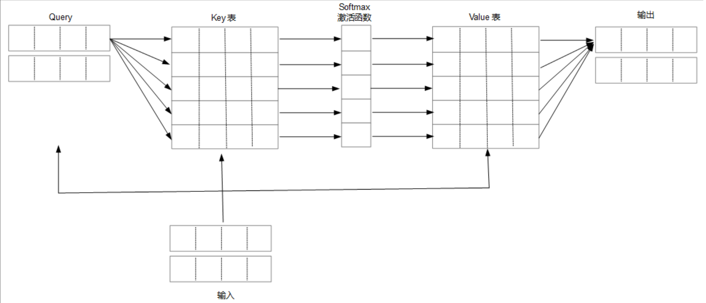

# 人工智能的原理及实践：GPT中的KV-cache

看到网上不少介绍KV-Cache文章以及大家对KV-Cache的不少疑惑，我有时候在想，一个KV-Cache的实现，有时候优化下来，一共不足10行代码，有必要讲述的如此复杂？

在前一篇文章中，我们讲述了人工网络的输入输出，如图：


在这个图中，我们每次输入给神经网络的都是句子的前面部分，而网络输出真正有效的，只有最后一个词。也就是说，这里面有大量的输出，其实是无效的、重复的，而且，随着对话越来越多，前面的词也变得越来越多，岂不是计算速度会越来越慢？

但我们在实际使用GPT过程中，发现其输出字的速度往往都是稳定的，并不会随着对话变长而变慢，原因就在KV-cache上。GPT通过KV-cache技术，让每一次仅仅是输入一个词，输出一个词，让响应速度一致保持稳定。而说起KV-Cache的原理，依然要从Attention中的QKV的原理说起。

Attention的核心原理如图：



在Attention的QKV计算中，每一个Q,K,V值都是从输入的词投影而来，并且与输入词一一对应。用K和V形成的是上下文词典表，Q是去查询表的键值。仔细看看这个词典表，是不是每一次多一个词，表就多一行？所以，理论上来说，只要我们维护一个不断增长的词典表（做一个大小上限，术语叫window_size)，然后，每次输入的词都从这个表去查上下文，不就可以了？这就是KV-Cache的核心思想。

在其代码实现时，完整的代码如下：

``` python
    # -- append kv cache --
    if state is not None:
        window_size = self.window_size if self.window_size is not None else 128
        if 'cache_kv' in state:
            cache_k, cache_v = state['cache_kv']
            k = np.cat((cache_k, k), dim=1)
            v = np.cat((cache_v, v), dim=1)
        state['cache_kv'] = (k[:,1-window_size:].detach(), v[:,1-window_size:].detach())
```

当然，这是在基于理解前面那篇文章的前提下的，