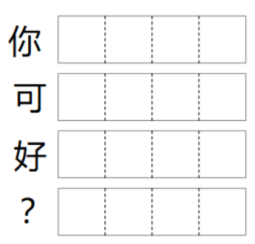

# 人工智能原理及实战：从零到Transformer、GPTs

## 1、张量的概念

人工智能领域，如何表达现实意义？答案是：张量（其实就是一组小数，英文：Tensor），比如：

### 1.1、一张的黑白图片

一张尺寸为$28*28$的黑白图片，是由一个二维张量组成，其结构为（28，28），也就是一共由$28*28$个小数组成，其中每一个值，代表图M片在特定位置的灰度。


### 1.2、一张彩色图片

一张彩色图片，则是由一个三维张量组成，其结构类似（3, 128, 128），用字母可以表示为（C,H,W), 其中：
1. C 值为3，常被称为通道（Channel）数，表示一个像素点，由3个值组成，分别是红、黄、蓝；
2. H 值为128，被称为高度（Height），表示一张图片的高度为128个点
3. W 值为128，被称为宽度（Width），表示一张图片的宽度为128个点
整张图片编码，其实一共由 3 * 128 * 128 个小数组成。


我们把数据转化为张量方式，称为编码。类似图片这种已知的确定编码，则直接使用现有成熟的编码，但对于一些人类不知道如何编码合适的情况下，如何编码？

### 1.3、一个分类

如果有十种分类，该如何编码分别表达这十种分类？好吧，不知道，就用概率吧，用十个值分别代表是相应分类的概率，在人工智能领域，我们把这种编码方式，称为OneHot编码（哪个类型概率高，则为热点，概率值为1，其余类型概率值则为0）。

比如：表示一个分类为的张量结构为：（10），包含10个小数值的一维张量。如图：


在这个图中，由于分类5的概率最大，所以，我们认为表示的是分类5。当然，在已经非常确定的分类（概率100%），我们可以直接使用下面更精确的编码，表示确定度极高，比如：

1. 第一个分类的编码：[1,0,0,0,0,0,0,0,0,0]
2. 第六个分类编码：[0,0,0,0,0,1,0,0,0,0]

以此类推，看上去是有点冗余是吧？没办法，谁让我们不知道怎么编码合适。

### 1.4、一个词

从正常思维角度，我们可以用OneHot编码所有的词，比如：全球一共有10万个词，我们可以用10万个浮点数组成的张量，编码一个词。这么做唯一的问题，就是计算量太大了，所以，在实际人工智能领域，我们往往用少一点的浮点数张量，来编码词，比如：用1024个浮点数组成的张量来编码词。

这样，十万个词，就有十万个编码，每个编码1024个浮点数，整个编码表大小为: $ 100K * 1K = 100M $，即便这样，整个编码表依然很大，但进入到了可以接受的范围里了。

### 1.5、一个句子

如果一个词，我们用一个结构为（1024)的张量编码，那一个包含50个词的句子，我们则可以用一个结构为：（50,1024)的二位张量进行编码了。后续，我们大多会用如图方式表示句子：



其中：
1. 长方形表示一个包含多个浮点数的一维张量；
2. 由一维张量组成的二维张量，表示一个自然语言句子；

### 1.6、其它

比如：
1. 在围棋里，可以用形状为（3，19，19）的张量来表示棋局，其中，每一个值，表示棋盘位置上，为黑棋或白棋或空白的概率；
2. 等等

其中：
1. 人工智能里，最容易处理的值范围，最好在(0,1)之间，代表概率值；
2. 另外每一个编码的形状必须是确定的，不能是变化的；也就是说，绝大多数网络，输入和输出的结构是不能变化的。

## 2、神经网络的概念

神经网络本质上，就是将一个概念转化为另外一个概念的转化计算器，里面包含大量转化计算需要的参数（被称为网络权重）。

比如：
1. 图片分类网络：把图片编码转化为图片对应的分类编码；
2. 自然语言翻译网络：把一种语言编码转化为另外一种语言编码；
3. 人脸识别网络：把人脸图片编码，转化为一组代表一个人的特征编码；
4. 等等

### 2.1、网络结构

我们之所以称之为神经网络，是因为普遍的有效的神经网络，往往都是由很多层组成的，后来发现层数越多往往效果越好，我们又把层数很多的网络称为深层神经网络。


### 2.2、网络权重

在神经网络中，用于计算输入输出关系的参数，被称为权重。打个比喻，比如：你就是那个神经网络，而功能就是输入一个石头，输出是扔石头砸树上的鸟。


那么，可能有两个参数需要控制，一个是力度、一个是角度。这两个参数，就是网络权重。

### 2.3、网络学习

有了网络权重，那这两个权重的值是怎么来的呢？想想扔石头的你吧，是不是先随机选择要给角度和力度试试，这就是权重的初始化。

然后不断的试，力度大一点、小一点，角度高一点、低一点，直到能够扔准而止。

是的，神经网络也是这样的，先随机初始化一些权重，然后不断的去试、去调整参数，直到我们觉得误差可以为止。这个过程就是神经网络的训练过程（和你训练扔石头一个道理）。

这里面喜欢思考的人很容易问一个问题，就是我怎么知道力度和角度调多少合适呢？这的确是一个相对复杂的问题，这也就是现在大量神经网络文章难以理解的地方之一。可喜的是，Pytorch、Tensorflow这种框架，已经帮你自动解决了这个问题了。就像你扔石头，旁边有一个教练一样，你每扔一次，只要你告诉它你使用的是什么参数，他就会告诉你，高度再高一点、力度再大一点，等等等等。

## 3、初尝神经网络

### 3.1 基础概念

在神经网络中，数字识别往往学习神经网络概念最好的起点，在这里面，能够让大家对神经网络有一个初步的认识。MNIST的范例，一般整体过程如图：


整体过程，是先将训练的图片分成多个批次，送入神经网络中，每一个批次转化为对应的分类编码，再与数据集中的期望编码进行对比，根据对比之后的误差，来调整网络参数。循环如此，直到所有的批次处理完成。在实际神经网络实践中，这里多了很多的工程时间概念，包括：
1. 数据集：数据集就是用来训练神经网络的经验数据，往往包括输入和对应期望网络的输出。而MNIST就是一个图片数字识别数据集，里面的训练数据，包含5万张$28*28$的黑白数字图片，以及50000个对应的分类签。
2. 批量化(batch)：在实际的神经网络训练过程中，往往不是一个一个数据的送进去训练，而是一批一批的数据，送到网络中进行训练，这个批次的大小，我们称之为bath_size。至于为什么会这样？主要出发点是为了，训练起来更快，训练时参数调整更稳定（一批数据训练后再整体调整参数）。
3. 损失误差（loss），损失误差其实就是扔石头的偏差，只有直到偏差大小，才能够确定如何调整参数。对于分类网络来说，直接把输出编码和训练集中的预期编码直接对比，就可以计算出偏差。不过，在实际工程实践中，常用称为交叉熵的计算方法，来评估误差，这里面涉及到一些数学原理及推导在里面，如果你不是研究算法底层的，可以先忽略这一点。算两个值之间的误差，有很多办法：mse对应的是均方差，crossentroy对应的是交叉熵，本质上，各种误差算法都是可以的，只不过，有一些在特定场景，效果更好。
4. 训练周期(epochs)：就是把一个数据集重复训练多少次。

有些时候，文字的理解，远不如代码清晰，我想以一个我所用的环境为例，讲讲如何实现这个网络。

### 3.2、第一个神经网络

为了简化代码，你可以下载安装一个我分享的一个环境，在这个环境中，你可以暂时不用关心训练的细节，只是专注于网络原理及应用。地址为：https://github.com/agiwave/aka


具体的代码如下：

``` python
import aka.nn as nn
import aka.data as dataset

# 定义神经网络
model = nn.Sequential(
        nn.Flatten(),                   # 将图片二维张量，转化为一维张量，(B, 28, 28) -> (B, 576)
        nn.Linear(28*28, 576),          # 将图片张量，做线性变化，(B, 576) -> (B, 576)
        nn.ReLU(),                      # 将张量中的负数，设置为零，消除这部分参数的影响
        nn.Linear(576, 10)              # 将图片张量，转化为图片分类张量
    )

# 训练神经网络
nn.train(
    model,                              
    dataset.MNIST(),                    # 训练数据集
    loss_metric=nn.CrossEntropyLoss(),  # 训练损失计算函数
    batch_size=64,                      # 批次大小，表示多少张图片组成一个批次，一起训练
    epochs=1,                           # 整个训练重复多少次
    show_chart=True)                    # 是否显示训练结果图片
```

这是一个几乎极简的数字图片识别网络，一共又四层运算叠加组成，其中：
1. 顺序执行的容器：nn.Sequential()，是表示生成一个顺序执行的神经网络容器；
2. 第一层网络：nn.Flatten()，负责把表示一批图片的三维张量，转化为一个二维张量，其张量形状变化为：输入（B, 28, 28)-> 输出(B, 576)，其中B正是上面介绍的批次大小；
3. 第二层网络：nn.Linear(576, 576)，负责把批次里面的每一个张量，线性变化为另外一批张量，其形状变化为：输入(B, 575)->输出(B, 576);
4. 第三层网络：nn.ReLU()，负责剔除网络输出里面的负数，转化为零；
5. 第四层网络: nn.Linear(576, 10)，负责再做一次线性变化，输出一批表示图片分类(十个分类）的张量，其形状变化为：输入（B，576)->输出(B, 10)

### 3.3、神经网络的本质是张量运算

从第一个范例中，第一个重要的运算，就是nn.Linear()，这是什么运算？其实就是每一个张量输出值，都是由所有的输入值通过线性计算而计算出来的，而线性运算，应该是在大家所理解的范畴内的内容，其公式为：

$ y_i = a_{i1} * x_i + a_{i2} * x_i + .. + a_{in} * x_n + b_i $

也就是说，从一个大小为（576）的张量转化为另外一个大小为(576)的张量，就是由576个这样的公式计算出来的，其中，所有的a和b，就是神经网络的权重（参数）。事实上，所谓的神经网络，本质上，就是由一系列这样的张量运算组成的，输入是张量，输出是张量，中间的运算过程全是张量运算。

而pytorch、tensorflow、jax等神经网络框架，最重要的部分就是张量运算。为了让大家更清楚的看到网络的本质，我们将第一个神经网络改写为更接近网络本质的张量运算版本。

``` python
import aka.nn as nn
import aka.numpy as np # 引入张量运算库
import aka.data as dataset

def MNIST():
    def __init__(self):
        self.a1 = nn.Parameter(shape=(784, 576))
        self.b1 = nn.Parameter(np.zeros(576))
        self.a2 = nn.Parameter(shape=(576, 10))
        self.b2 = nn.Parameter(np.zeros(10))
        return self
    def forward(self, x) :
        x = np.flatten(x, 1)
        x = np.matmul(x, self.a1) + self.a2
        x = np.relu(x)
        x = np.matmul(x, self.b1) + self.b2
        return x
    return __init__(nn.Module(forward=forward))

nn.train(
    MNIST(), 
    dataset.MNIST(),
    loss_metric=nn.CrossEntropyLoss(), 
    batch_size=64, 
    epochs=1, 
    show_chart=True)
```

这个版本中，
1. 其功能与第一个版本完全一样，写法不同而已；
2. 自己定义了张量运算需要的四个张量参数: a1, b1, a2, b2；
3. 自己定义了张量运算的函数：forward
4. 用一个容器将上述要素打包为pytorch需要的对象：nn.Module；
5. 当然张量运算会有很多不同的算法，无论pytorch、tensorflow、jax，都会力求其使用方式类似与业界通用的numpy张量运算库；

从上面可以看出，神经网络的本质，其实就是张量运算网络，不同的运算网络，形成了包含不同参数的不同的网络模型。而这些张量运算中，最常用的张量运算，包括：
1. 形状变化类：np.Flatten(展开), np.reshape(形状转化), np.rearrange(更高级一些的变化) ...
2. 激活函数类：ReLU（去掉负值），softmax(转化为权重值) ...
3. 矩阵运算类：+/-/*//(加减乘除), np.matmul(矩阵乘), np.bmm(批量矩阵乘), np.einsum(高级矩阵运算) ...
4. 复杂运算：Conv(卷积)...
5. ....
总之，矩阵运算非常的多，你几乎都可以用来定义你的神经网络运算（注：如果实在不符合你的要求，其实你还可以写c++扩展，来自定义自己的运算，不过，c++扩展就复杂多了，因为框架不会帮你自动计算需要如何更新参数，必须由你自己来完成。）

### 3.4、一个2012年的冠军网络AlexNet

让我们再看一眼2012年图像识别的冠军网络的定义，如下代码：

``` python
import aka.nn as nn
def AlexNet(num_channels=3, num_classes=100):
    '''AlexNet

    Remark:
        Input shape of AlexNet should be [B, C, H, W] = [Batch Size, Channels, Height, Weight]

    Args:
        num_channels: Image channels. It should be 1 or 3
        num_classes: The output tensor size. One hot category tensor.
    '''
    stride=4
    padding=2
    return nn.Sequential(
        # -- Conv ---
        nn.Conv2d(num_channels,48,kernel_size=11,stride=stride,padding=padding),
        nn.ReLU(),
        nn.MaxPool2d(kernel_size=3,stride=2),
        nn.Conv2d(48,128, kernel_size=5, padding=2),
        nn.ReLU(),
        nn.MaxPool2d(kernel_size=3,stride=2),
        nn.Conv2d(128,192,kernel_size=3,stride=1,padding=1),
        nn.ReLU(),
        nn.Conv2d(192,192,kernel_size=3,stride=1,padding=1),
        nn.ReLU(),
        nn.Conv2d(192,128,kernel_size=3,stride=1,padding=1),
        nn.ReLU(),
        nn.MaxPool2d(kernel_size=3,stride=2),

        # -- Classifier --
        nn.Flatten(),
        nn.Linear(6*6*128,2048),
        nn.ReLU(),
        nn.Dropout(0.5),
        nn.Linear(2048,2048),
        nn.ReLU(),
        nn.Dropout(0.5),
        nn.Linear(2048,num_classes)
    )

if __name__ == "__main__":
    import aka.data as datasets
    nn.train(
        AlexNet(), 
        datasets.ImageFolder(root="./data/ImageNet", resize=224), 
        loss_metric=nn.CrossEntropyLoss(), 
        batch_size=64, epochs=5)
```

在AlexNet网络中，引入的一个非常重要的张量运算函数：卷积，并且在图像识别中，取得了当年突破性的进展（能有识别大量图片中的内容分类）。如果后续有时间，可以考虑另外再介绍一下卷积的原理，但在这里，只是让大家稍微扫一眼，当年冠军网络的大概的样子（注意：这不是当年的源代码，而是我个人照着当年的原理，重写的代码）。

必须说明，在近十年网络的发展中，这儿跳过了两个非常重要的神经网络运算：以卷积为主的卷积网络（CNN），循环计算的循环网络（RNN），不是他们不重要，而是在这儿希望能直接切入最流行的Transformer网络。


## 4、Transformer变形金刚

自从2017年Google发表了《Attention is all you need》，到OpenAI的GPT，直到现在，已Attention为主的Transformer一直在神经网络中成为绝对的主力，是什么魔力让Transformer如此流行？里面的原理究竟如何？这应该是本文的重点。

### 4.3、总体结构


整体上，对于初学者，这个结构还是显得有点复杂，其实，我们可以从一个更简单，更流行的结构学起，这个就是GPT结构，理解了GPT结构，
就更容易理解当年Transfomer的的完整含义了。当然，需要说明的是，Transformer里面的核心思想，其实恰恰就在更简化的GPT结构中，理解最原始的Transformer的必要性，其实并不是那么重要。我们直接从Transformer中截取最重要的GPT结构部分，如图：


再这个结构中，最核心的模块，就是Attention模块，但想要了解整个结构，还需要一点一点的说起。

### 4.4、输入输出

在GPT中，输入输出结构如图：


在这个图中，体现了GPT网络的一些主要特征：
1. 输入输出都是由词的在词表中编号（整数）组成的句子；
2. 每一个位置对应的输出，都是网络预测的当前位置的下一个词，这是GPT核心特征；

在GPT的整个生成过程中，其实每一次计算，都只是预测下一个词，所以，几乎所有的GPT在使用的时候，你都能看到，GPT的输出是一个词一个词连续输出的，这正是因为其内在运作机制造成：
1. 首先输入提示词，比如：“你是AI吗？”；
2. 然后网络预测下一个词“我”（在？号那个位置的输出，其它前面的输出一般直接忽略）；
3. 将预测的下一个词放到输入的最后，“你是AI吗？我”，然后通过神经网络再预测下一个词，“是”；
4. 重复上面的过程，直到神经网络预测输出一个结束词；

当然，在神经网络的训练时，并非一个词一个词的预测，而是整个句子一起预测，但采用了一种方法，让网络中每一个位置的参数，都只能看到当前位置以及之前位置的信息，看不到之后位置的信息，这个在介绍Attention时，会有所了解。

### 4.5、词表嵌入：Input Embedding模块

在前面的输入输出中，所有的值都是词在词表中的位置，这不是神经网络能学习的内容，那如何将输入输出转化为神经网络擅长的词编码，输出时又如何将词编码转换为对应的词在词表中的位置呢？

先让我们看一下我们定义的词表结构，其实非常简单，就是一个二维张量，其中每一行就是一个词的编码，代表一个词；行号，就是词在词表中的位置，也就是输入输出中的整数值。


因此，输入中的Input-Embedding模块实现，就非常简单了：
1. 定义一个词表，结构如图，其中的词编码作为神经网络的训练参数，让神经网络自己去学习如何编码每一个词；
2. 用输入的每一个词的编号查表，然后转化为由词编码组成的张量；
3. 一般情况下，词嵌入的输入为张量的形状为：（B,L)，输出的结构则为（B,L,D)，其中：B - 表示训练或者推理时的数据批次大小；L - 表示输入句子的长度（由多少个词组成）；D - 就是一个词编码的长度（即一个词编码由多少个小数组成）；

而在输出时，将词编码转化为词在词表中的位置呢？其实方法和前面的MNIST范例完全一样，就把词表中的每一个词，当成一个分类即可，输出的时候，将每一个词编码通过线性变换，转化成分类的OneHot编码，就可以了，比如：

如果词编码张量的形状为（512)，而词表一共有10万个词，则将词编码转化为词的OneHot编码的模块就可以为：nn.Linear(512,100000)，其实就是把形状为（512）的编码线性变换为形状为（100000）的编码; 和MNIST范例中的最后一行，原理完全一样。

注意：在有些GPT中，比如：Google的Gemma中，将词编码转化为词的OneHot编码中的参数，直接复用Input Embedding模块的词表参数，这样有效的减少模型的参数量。

在这儿，我们有必要在重新理解一下线性变换本质，究竟做了什么，意义何在，为什么可以直接用Input Embedding的词表参数？

### 4.6、线性变换本质

一个典型的线性变化，其结构如下图：


其实，可以把线性变换(nn.Linear)看成一个编码表，然后把输入的编码与编码表中的每一个编码，一一计算相似度，把所有的相似度作为变换的输出。

（另外：至于相似度的算法，主流采用的都是线性变换。事实上，有没有其它相似度算法呢？答案是，有的，比如对比两个编码的距离等等）

在Transformer中，为什么线性变换能够直接使用Input Embedding中的权重（编码表），也就是因为线性变换的本质原因造成。理解线性变换的本质，对于后续学习Transformer非常重要。

### 4.7、Feed Forward模块

接下来，我们再来看看总体架构途中的Feed Forward模块（FFN）结构，典型的FFN模块，如图：


在Transformer中，FFN模块非常有效，甚至不可或缺，被认为是网络中知识记忆的关键，不过，其本身结构并不复杂，甚至这个结构和我们最简单的MNIST范例完全一致，就是两个线性变换，中间夹了一个激活函数(ReLU)。为什么是这样的结构？为什么不是一层或者三层？激活函数的作用究竟是什么？让我们把FFN网络换个角度画出来，或许我们可以如下图一下，理解FFN网络。


图中：
1. 我们把FFN网络理解为一个查表运算，输入就是用于查表的key值（被称为Query），第一个线性变换是一个字典的Key表，第二个线性变换是字典的取值表；
2. 线性变换计算过程就是：Query通过第一个线性变化，计算出它与字典中的每一个Key值的相似度，然后根据这个相似度，分别乘以第二个线性表中的值，最后把所有值加起来就是输出;
3. ReLU激活函数，本质上就是把所有的负值修改为零，其意义本身就是把相似度为负的值直接剔除，消除那些不相似的值对输出的干扰，也就是一个突出重点的过程。（当然，剔除不重要的值的激活函数，不止ReLU，还有GeLU、Silu、Softmax等等，有一定区别，但本质一样）;

所以，两层线性变换，其实能够完成一个查表运算，根据表格把每一个输入的编码，转化为完全不同的另外一种编码。就像翻译一样，把一种语言翻译成另外一种语言。

或许有人会问，查表难道不是只取字典表中的某一个值吗？的确可以，但计算机更擅长概率计算，而不是非此及彼。试想一下前面所说的扔石头的场景，如果你扔的时候，只有两个力度，并且每次选择其中一个力度，那教练如何才能让你学会准确的把石头扔到目标处？不行吧，你的选择，必须是连续的，才能够很好的完成训练。神经网络也是如此，这就是查表为什么是把所有值加权求和的原因，当然也会尽量突出重点（ReLU）。

由于在FFN中的查表计算，是针对每一个词的编码独立计算的，但是，两种自然语言之间的翻译，能够一个字一个字的独立翻译吗？显然不是，每一个语言都有自己的语言顺序，这注定了：FFN非常重要，但无法独立解决自然语言的翻译任务。所以，我们需要将每一个字的翻译与前面和后面的字结合起来看，才能完成，这就是我们最重要的Attention模块的意义：上下文相关计算。

### 4.8、Attention模块

Attention模块是Transformer中的最核心模块，正是这个模块，让神经网络的每一个词的输出，能够与其前面和后面的词相关，也就是结合上下文来输出，在人工智能行业里，我们把它称为时间维度混合模块。其结构常见的表达如图：


其实这个图，反应的是输入张量如何运算产生输出的计算，并不便于理解其中的缘由。

在这儿，我们换一个思路去理解，如果想要每一个词与前面和后面的词相关，那是否可以有一个上下文相关的词典表，然后用类似FFN模块的查表方式，来计算输出结果呢？答案是，可以，并且Attention正是基于这样的思路，来设计的。我们把Attention换个视角展开，如图：


这个图是不是和FFN的结构非常相似？是的，原本FFN就是一种很有效的计算模式，在这个图中：
1. 为了让输出与上下文相关，我们直接通过输入投影出一个Key表和Value表，这个表中，包含了整个上下文中的所有值；
2. 然后把当前的词投影出一个查询词，去对这个上下文相关的Key-Value表做与FFN模块相同的查表计算；
3. 与FFN模块不同的是，ReLU替换成了Softmax，并且还把所有的值先做了一次缩放（都除以sqrt(d)，其中d词编码的维度大小）；其实，用ReLU或者其它的激活函数可不可以？答案是：可以，这正是各种Attention变种存在的空间之一。Softmax这种激活函数的特点就是，经过softmax变换后，编码中所有的值之和为1，这种特性，能够有效的避免输出值太大或者太小。而缩放计算，是因为在计算softmax时，如果计算前值太大或太小，会很容易造成权重集中到特定值上，造成网络难以学习。至于为什么系数是sqrt(d)，这里面是一个概率问题，有其数学原理在其中，这就不是这儿讨论的重点了。

为什么Query/Key值是从输入线性变换投影出来，而不是直接用输入做Key？因为我们在计算上下文相关度、相似度是，最好在另外一个维度进行，比如：形容词往往是形容名词的，名词后面常接动词等等，而词性，自然和词本身是不同。

到这儿，其实有一个问题，不知道大家发现与否，当我们在用Query去查询上下文的Key-Value表时，相似度的计算，只与词的值有关，和词在什么位置，毫无关系，也就是说，无论词在什么位置，通过这种计算，算出来的结构都是一样的。这违背了语言的本质，语言原本就是顺序相关的，词在什么位置和整个句子的含义是相关的，那如何让查表，以及计算相似度的时候，能够与词所在的位置有关系？这正是Position-Embedding存在的意义。

### 4.9、Position-Embedding模块

Position-Embedding就是在每一个词的编码中，加上它在句子中处于什么位置的编码。

我们为每一个位置，定义一个代表位置编码的张量，其结构与输入完全一致，然后把输入与代表位置的张量相加，得到真正的输入，这样，每一个词的编码中，就包含了位置信息。

至于编码究竟是取什么值？没关系，把它设为神经网络的可训练参数吧，让我网络自己去学习去。（我们总是这么干，不知道，就给个随机数，让网络自己去学习）。

由于有了Position-Embedding编码，在Attention计算时，每个词的相似度计算就与它所在的位置有关了。

到此，我们还有三个相关内容没有涉及，一个是：
1. Add & Norm模块；
2. Multi-Head Attention；
3. Mask；

### 4.10、Add & Norm

Add & Norm其实是两个张量算法。

Add其实就是把Attention模块和FFN模块的输入加上输出，作为最终的模块输出，这种算法在神经网络里被称为残差算法，是微软在2015年首先提出，虽然非常简单，但对深度神经网络训练非常有效。我们从原理上可以理解为，一个模块即便什么都没学到，它后面的模块依然能够获得有效的输入信息，而不至于因为这个模块快的无效输出，什么也无法学到。

Norm其实和名字一样，把过大或过小的编码归一化，转化到计算及擅长处理的值范围。这也是一种非常有效的，加速训练的技巧，能够避免计算输出值过大或过小的时候，无法训练（没有什么有效信息）的问题。

### 4.11、Multi-Head Attention

多头注意力本身和注意力的区别在于，多头注意力把一个词的编码，看成是由多个编码组成，然后每一个编码单独进行Attention计算。

比如：如果原本一个词的编码长度为(512)，如果是头设置是4的化，则把一个(512)的编码，当成4个维度为(128)的词编码，然后，分别独立计算。

### 4.12、Attention中的Mask机制

回头看看我们的Attention机制，其实在GPT应用中，还有一个遗留问题，就是Key-Value表其实包含了整个句子中的所有上下文内容，如果通过当前词去查表是，它直接和它后面的词相关，然后输出预测词，那这不是作弊吗？这根本就不是根据前面的词去预测后面的词。

为了避免网络计算变得这么投机取巧，做了一个限制，就是所有的词在查表的时候，只能查表中比它靠前的部分内容，这个词之后的相似度查询结果，全部直接设置为0，这样才能有效的训练出生成式网络。

### 4.13、再回看Transformer图


在这个图中：
1. 左边部分被称为编码器，因为Attention部分没有Mask，对整个句子编码，能够看的越全越好，无需Mask；
2. 右边部分被称为解码器，因为总是由前面的词预测后面的词，所以，每一个Attention模块，都是加了Mask机制的；
3. 在解码器中，还多加了一个Attention模块，在这个模块中，Q和K值来源于编码器编码的输出，而不是来自与预测结果输入；
4. Nx表示重复的个数，相同结构重复多次；

没有了.

## 5、其它GPT相关要素

### 5.1、Rotary-Embedding

在新的大量GPT系统中，Postion-Embedding被替换成了Rotary-Embedding，其主要区别在于：
1. Position-Embedding是加在整个输入里面，而Rotary-Embedding是加载Query和Key上；
2. Position-Embedding大多是让网络自己去学习参数，而Rotary-Embedding是根据人类经验，直接固定了一种表示位置信息的旋转编码；其实，这不是最核心的，因为根据经验，即便是旋转编码，相信神经网络自己也能学习出来；

### 5.2、Gated-MLP

GatedMLP其实是FFN/MLP的一种改进版本，其结构如图：


与传统FFN和MLP不同的是：ReLU等传统的激活函数，替换成了乘以一个由输入投影出来的结构相同，并且经过Sigmoid运算后的张量，Sigmoid激活函数的数学特性就是把值始终控制在（0，1）范围，就像一个信号强弱控制的门（系数）一样。所以，才被称为GatedMLP，门控MLP。

### 5.3、Tokenizer

在这个GPT网络中，输入输出都是词的编号，是一个整数，这个编号又是怎么算出来的？我们如何很好的去把自然语言都给出一个很好的编号？这其实也是一个问题，好在行业里有大量的工作，已经把这件事事情做好了，直接拿来用就好了，而其中的原理对于学习GPT本身，并不相关。就不做细说了。

## 6、总结

到此，其实和主流GPT相关的内容及原理，应该涉及的差不多了，如果你足够熟悉张量运算以及Pytorch等这样的神经网络框架，应该可以自己写出GPT网络了。基于上述理解，作者也直接尝试写出并运行了Gemma模型。

其范例地址放到了：https://github.com/agiwave/Gemma

当然，如果想要看看作者完整的运行环境，以及更多的范例，可以参考：https://github.com/agiwave/aka，
里面包含了大量超出本文的内容，比如：Mamba、RetNet类的循环神经网络类GPT，MAE、VQVAE、VQGAN类的图像处理等模型；当然，严格的测试，是没有的，因为对于我来说，还未投入生产领域。

